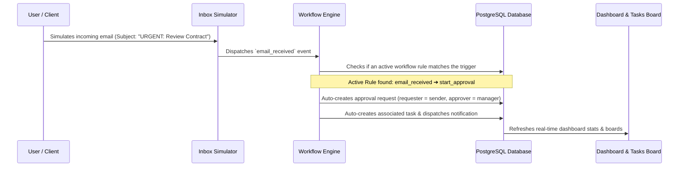

# Outlook Workflow Hub 🏢

> **Enterprise Productivity Platform** — built with React 18 + Material UI + TypeScript + Node/Express + PostgreSQL.

Outlook Workflow Hub is a modern enterprise task management and automation workspace. It integrates email parsing, task assignment, multi-stage approval workflows, document version control, calendar meetings, and audit logs.

---

## 🌟 Core Features

- **📊 Unified Dashboard**: Stat cards, progress metrics, real-time activity feeds, dynamic analytics charts, and upcoming deadlines in one single dashboard.
- **✉️ Inbox & Email Parsing**: Simulates incoming Outlook emails and converts them into structured tasks automatically or manually based on triggers.
- **⚙️ Automated Workflows**: A visual engine that lets you configure trigger-to-action rules (e.g., `email_received` trigger ➔ `start_approval` action).
- **📋 Task Management**: Interactive boards supporting task descriptions, prioritization levels (`low` to `critical`), assignee selection, custom comments, activity tracking, and attachments.
- **🔑 Approval Queues**: Multi-state workflow approvals (Pending, Approved, Rejected, Escalated) linking managers and employees.
- **📅 Meetings & Action Items**: Schedule team syncs, record meeting notes, list participants, and directly convert action items into trackable board tasks.
- **📂 Document Management**: Upload project documents and track complete revision histories with version increments.
- **🕵️ Audit Logging**: Complete immutable ledger log recording every event (logins, actions, target entity types, IP addresses, and user-agents) for administrative inspection.

---

## 🖥️ Page-by-Page Functionality Guide

The application consists of several primary views, each serving a specific business function:

1. **Dashboard (`/dashboard`)**:
   - **Overview Metrics**: Displays dynamic statistics cards showing Total Tasks, Pending Tasks, Completed Tasks, and Pending Approvals.
   - **Visual Analytics**: Interactive charts indicating task progress, state distribution, and completion trends.
   - **Reminders & Deadlines**: Warns users of tasks nearing their due dates.
   - **Activity Feed**: Shows a real-time list of actions taken across the workspace.

2. **Inbox Simulator (`/inbox`)**:
   - **Simulated Outlook Feed**: Mimics an enterprise inbox, displaying incoming emails.
   - **Manual Conversion**: Allows users to select any email and manually convert it into a task, parsing the subject and body.
   - **Workflow Triggering**: Simulates the background engine where incoming emails automatically trigger predefined actions.

3. **Tasks Board (`/tasks`)**:
   - **Task Lifecycle**: Track tasks from `Todo` to `Completed`, `Overdue`, or `Blocked`.
   - **Detailed Inspections**: Click any task to open a detailed modal pane containing comments, audit logs, and file uploads.
   - **Collaboration**: Leave custom feedback comments and attach files directly to specific task entities.

4. **Approval Queues (`/approvals`)**:
   - **Requester View**: Employees can create new approval requests (e.g. Budget reviews, vacation requests), defining a title, description, and target approver.
   - **Approver View**: Managers can see a filtered feed of requests waiting for their approval, allowing them to type in comments and Approve or Reject the request.

5. **Workflows Engine (`/workflows`)**:
   - **Automation Rules Builder**: Create automation triggers (e.g. when an email is received with a keyword, auto-assign a task or start a review approval).
   - **Execution Logs**: Inspect historical logs of all automated runs, indicating whether actions succeeded or failed.

6. **Meetings (`/meetings`)**:
   - **Calendar Planner**: Schedule and display future team meetings.
   - **Minutes of Meeting**: Jot down structured notes and list all meeting attendees.
   - **Action Item Conversion**: List action items during a meeting and convert them directly into tasks on the task board with designated owners.

7. **Documents (`/documents`)**:
   - **Shared Vault**: A centralized vault for storing project documents.
   - **Version History**: Upload updated document revisions without overwriting, tracking file size changes, uploaders, and revision numbers sequentially.

8. **Audit Logs (`/audit-logs`)**:
   - **Administrative Ledger**: (Admin-only page) Displays an immutable table of all security and database actions.
   - **Metadata Filtering**: Filter events by user, specific actions (e.g. login, document upload), target entities, and inspect IP/browser user-agents.

---

## 👥 User Roles & Access Matrix

The application supports three distinct role types, each with tailored views and administrative access controls:

| Feature/Module | Employee 🧑‍💼 | Manager 👨‍💼 | Admin 👑 |
| :--- | :---: | :---: | :---: |
| **View Dashboard & Stats** | Yes | Yes | Yes |
| **Manage & Comment on Tasks** | Yes (Own / Assigned) | Yes (All) | Yes (All) |
| **Request Approvals** | Yes | Yes | Yes |
| **Approve/Reject Requests** | No | Yes | Yes |
| **Create & Update Workflows** | Yes | Yes | Yes |
| **Schedule Meetings** | Yes | Yes | Yes |
| **Upload Documents & Versions** | Yes | Yes | Yes |
| **View Audit Logs (`/audit-logs`)** | No (Access Denied) | No (Access Denied) | **Yes (Full Access)** |

### Detailed Role Descriptions:

1. **Employee (`employee`)**:
   - Focuses on execution. Can view, edit, comment, and add attachments to tasks assigned to them or created by them.
   - Can submit new approval requests to managers.
   - Can participate in meetings and upload document revisions.
2. **Manager (`manager`)**:
   - Oversees projects and operations.
   - Has full visibility to manage all tasks across teams.
   - Authorized to review, approve, reject, or escalate approval requests.
   - Can manage team meetings and review analytics.
3. **Admin (`admin`)**:
   - Complete system control.
   - Authorized to inspect the global **Audit Logs** ledger (`/audit-logs`) to monitor security, access patterns, IP addresses, and system modifications.
   - Can manage system-wide workflows and perform administrative operations.

---

## 🔄 System Flow: How It Works

### 1. The Email-to-Task Pipeline


### 2. The Smart Follow-up & Escalation Engine
A background scheduler service runs in the backend on a cron-like timer (every minute) to process pending deadlines:
- **Reminder**: If a task follow-up's `reminder_date` is reached, it generates an automated in-app notification for the assignee.
- **Escalation**: If a task breaches its `escalation_date` without completion, the scheduler triggers an escalation event, flags the task, notifies the manager (creator), and raises an urgent warning to the assignee.

---

## 💻 Technical Architecture & Setup

### Repository Structure
```
├── backend/            # Express REST API (TypeScript)
│   ├── src/
│   │   ├── config/     # Winston logger, Env configuration
│   │   ├── controllers/# Express route handlers
│   │   ├── db/         # PostgreSQL client wrapper & migrations
│   │   ├── middleware/ # Auth validation, error handlers
│   │   ├── routes/     # API routes (v1)
│   │   └── services/   # Business logic (Auth, Tasks, Workflows, Scheduler)
└── frontend/           # React Single Page App (TypeScript + Vite)
    ├── src/
    │   ├── components/ # Reusable UI widgets & layout elements
    │   ├── contexts/   # Auth state provider
    │   ├── hooks/      # React hooks (Toast, Approvals, Fetching)
    │   ├── pages/      # View pages (Dashboard, Tasks, Audit Logs, etc.)
    │   └── routes/     # Protected route middleware & React Router tree
```

### 🛠️ Local Quickstart

#### 1. Setup Database
Ensure PostgreSQL is running locally on port `5432`.
Create the database:
```sql
CREATE DATABASE outlook_workflow_hub;
```

#### 2. Environment Variables Configuration

- **Backend** (`backend/.env`):
  ```ini
  NODE_ENV=development
  PORT=5000
  DB_HOST=localhost
  DB_PORT=5432
  DB_NAME=outlook_workflow_hub
  DB_USER=postgres
  DB_PASSWORD=Aary@9307  # Updated DB Password
  JWT_SECRET=outlook_workflow_hub_jwt_secret_key_dev_2024
  ```

- **Frontend** (`frontend/.env`):
  ```ini
  VITE_API_BASE_URL=http://localhost:5000/api/v1
  VITE_APP_NAME=Outlook Workflow Hub
  ```

#### 3. Run Migrations & Start Servers
Navigate to `backend` and run:
```bash
npm install
npm run db:migrate
npm run dev
```

Navigate to `frontend` and run:
```bash
npm install
npm run dev
```

---

## 🔑 Default Credentials

A default administrator account is automatically seeded into the database during migrations:
- **Email**: `admin@owh.com`
- **Password**: `Admin@123`
- **Role**: `admin`
- **Department**: `IT`
